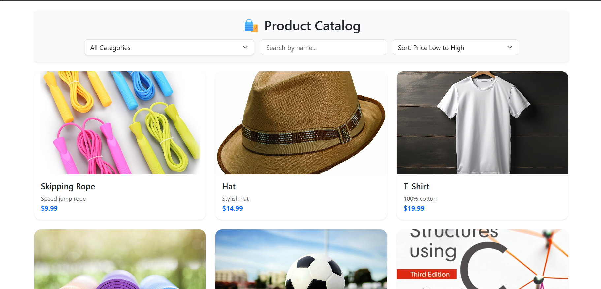

# 🛍️ Simple E-Commerce Catalog App

A full-stack web application for browsing and filtering products by category, with sorting and search capabilities.

Built with:

* **Frontend:** React
* **Backend:** Spring Boot
* **Database:** MySQL

---

## 📸 Demo

> 

---

## 🧱 Project Structure

```
ecommerce-app/
├── frontend/          # React.js application
├── backend/           # Spring Boot backend with REST APIs
├── .gitignore         # Root git ignore
```

---

## 🚀 Features

* Display product catalog with name, image, description, and price
* Filter products by category
* Sort products by price (ascending/descending)
* Search products by name
* Fully responsive frontend
* Backend seeding with sample categories and products

---

## ⚙️ Tech Stack

### Frontend (React)

* React 18+
* Fetch API for REST integration
* Bootstrap (via CDN or custom styling)
* Vite for dev server and build tool

### Backend (Spring Boot)

* Spring Web
* Spring Data JPA
* MySQL Driver
* Seed data via `CommandLineRunner`

### Database

* MySQL 8+
* Two tables: `categories` and `products`
* One-to-many relationship between `Category` and `Product`

---

## 🏁 Getting Started

### Prerequisites

* Node.js + npm
* Java 17+ and Maven
* MySQL server

---

## 🔧 Setup Instructions

### 1. 🛠️ Backend Setup

#### Database

```sql
CREATE DATABASE product_catalog;
```

#### Application Properties (`backend/src/main/resources/application.properties`)

```properties
spring.datasource.url=jdbc:mysql://localhost:3306/product_catalog
spring.datasource.username=your_username
spring.datasource.password=your_password

spring.jpa.hibernate.ddl-auto=create
spring.jpa.show-sql=true
```

#### Run the Spring Boot App

```bash
cd backend
mvn spring-boot:run
```

This seeds the DB with predefined categories and products.

---

### 2. 💻 Frontend Setup

```bash
cd frontend
npm install
npm run dev
```

Ensure `.env` in frontend contains:

```
VITE_API_BASE_URL=http://localhost:8080
```

---

## 🔄 API Endpoints

### Products

* `GET /api/products` – Get all products
* `GET /api/products/category/{id}` – Get products by category

### Categories

* `GET /api/categories` – Get all categories

---

## 📁 Frontend File Highlights

* `App.jsx`: Fetches and filters products, manages state
* `ProductList.jsx`: Displays products
* `CategoryFilter.jsx`: Dropdown for category selection

---

## 📁 Backend File Highlights

* `DataSeeder.java`: Seeds database with sample data
* `ProductController.java`: Product API controller
* `CategoryController.java`: Category API controller
* `ProductService.java`: Product business logic
* `CategoryService.java`: Category business logic
* `ProductRepository.java`: JPA repository

---

## 📜 License

This project is open-source and free to use under the MIT license.

---

